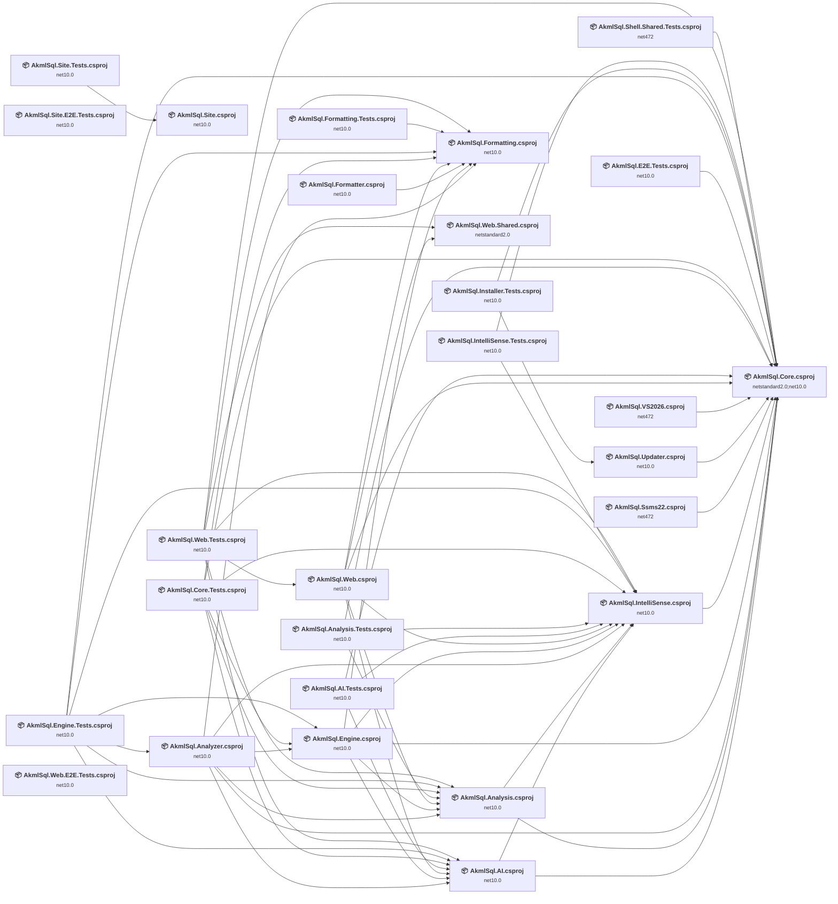

# Projects Relationship Graph

[← Back to the assessment index](../assessment.md)

Legend:
📦 SDK-style project
⚙️ Classic project

```mermaid
flowchart LR
    P1["<b>📦&nbsp;AkmlSql.AI.csproj</b><br/><small>net10.0</small>"]
    P2["<b>📦&nbsp;AkmlSql.Analysis.csproj</b><br/><small>net10.0</small>"]
    P3["<b>📦&nbsp;AkmlSql.Analyzer.csproj</b><br/><small>net10.0</small>"]
    P4["<b>📦&nbsp;AkmlSql.Core.csproj</b><br/><small>netstandard2.0;net10.0</small>"]
    P5["<b>📦&nbsp;AkmlSql.Engine.csproj</b><br/><small>net10.0</small>"]
    P6["<b>📦&nbsp;AkmlSql.Formatter.csproj</b><br/><small>net10.0</small>"]
    P7["<b>📦&nbsp;AkmlSql.Formatting.csproj</b><br/><small>net10.0</small>"]
    P8["<b>📦&nbsp;AkmlSql.IntelliSense.csproj</b><br/><small>net10.0</small>"]
    P9["<b>📦&nbsp;AkmlSql.Site.csproj</b><br/><small>net10.0</small>"]
    P10["<b>📦&nbsp;AkmlSql.Ssms22.csproj</b><br/><small>net472</small>"]
    P11["<b>📦&nbsp;AkmlSql.Updater.csproj</b><br/><small>net10.0</small>"]
    P12["<b>📦&nbsp;AkmlSql.VS2026.csproj</b><br/><small>net472</small>"]
    P13["<b>📦&nbsp;AkmlSql.Web.Shared.csproj</b><br/><small>netstandard2.0</small>"]
    P14["<b>📦&nbsp;AkmlSql.Web.csproj</b><br/><small>net10.0</small>"]
    P15["<b>📦&nbsp;AkmlSql.AI.Tests.csproj</b><br/><small>net10.0</small>"]
    P16["<b>📦&nbsp;AkmlSql.Analysis.Tests.csproj</b><br/><small>net10.0</small>"]
    P17["<b>📦&nbsp;AkmlSql.Core.Tests.csproj</b><br/><small>net10.0</small>"]
    P18["<b>📦&nbsp;AkmlSql.E2E.Tests.csproj</b><br/><small>net10.0</small>"]
    P19["<b>📦&nbsp;AkmlSql.Engine.Tests.csproj</b><br/><small>net10.0</small>"]
    P20["<b>📦&nbsp;AkmlSql.Formatting.Tests.csproj</b><br/><small>net10.0</small>"]
    P21["<b>📦&nbsp;AkmlSql.Installer.Tests.csproj</b><br/><small>net10.0</small>"]
    P22["<b>📦&nbsp;AkmlSql.IntelliSense.Tests.csproj</b><br/><small>net10.0</small>"]
    P23["<b>📦&nbsp;AkmlSql.Shell.Shared.Tests.csproj</b><br/><small>net472</small>"]
    P24["<b>📦&nbsp;AkmlSql.Site.E2E.Tests.csproj</b><br/><small>net10.0</small>"]
    P25["<b>📦&nbsp;AkmlSql.Site.Tests.csproj</b><br/><small>net10.0</small>"]
    P26["<b>📦&nbsp;AkmlSql.Web.E2E.Tests.csproj</b><br/><small>net10.0</small>"]
    P27["<b>📦&nbsp;AkmlSql.Web.Tests.csproj</b><br/><small>net10.0</small>"]
    P1 --> P4
    P1 --> P8
    P2 --> P4
    P2 --> P8
    P3 --> P4
    P3 --> P5
    P3 --> P1
    P3 --> P2
    P3 --> P7
    P3 --> P8
    P5 --> P1
    P5 --> P2
    P5 --> P4
    P5 --> P7
    P5 --> P8
    P6 --> P7
    P8 --> P4
    P10 --> P4
    P11 --> P4
    P12 --> P4
    P14 --> P1
    P14 --> P2
    P14 --> P4
    P14 --> P7
    P14 --> P8
    P14 --> P13
    P15 --> P1
    P15 --> P4
    P15 --> P8
    P16 --> P2
    P16 --> P4
    P16 --> P8
    P17 --> P4
    P17 --> P5
    P17 --> P7
    P17 --> P1
    P17 --> P2
    P17 --> P8
    P18 --> P4
    P19 --> P5
    P19 --> P3
    P19 --> P1
    P19 --> P2
    P19 --> P4
    P19 --> P7
    P19 --> P8
    P20 --> P7
    P21 --> P11
    P21 --> P4
    P22 --> P8
    P22 --> P4
    P23 --> P4
    P25 --> P9
    P27 --> P14
    P27 --> P13
    P27 --> P1
    P27 --> P2
    P27 --> P4
    P27 --> P7
    P27 --> P8
    click P1 "projects/AkmlSql.AI.md"
    click P2 "projects/AkmlSql.Analysis.md"
    click P3 "projects/AkmlSql.Analyzer.md"
    click P4 "projects/AkmlSql.Core.md"
    click P5 "projects/AkmlSql.Engine.md"
    click P6 "projects/AkmlSql.Formatter.md"
    click P7 "projects/AkmlSql.Formatting.md"
    click P8 "projects/AkmlSql.IntelliSense.md"
    click P9 "projects/AkmlSql.Site.md"
    click P10 "projects/AkmlSql.Ssms22.md"
    click P11 "projects/AkmlSql.Updater.md"
    click P12 "projects/AkmlSql.VS2026.md"
    click P13 "projects/AkmlSql.Web.Shared.md"
    click P14 "projects/AkmlSql.Web.md"
    click P15 "projects/AkmlSql.AI.Tests.md"
    click P16 "projects/AkmlSql.Analysis.Tests.md"
    click P17 "projects/AkmlSql.Core.Tests.md"
    click P18 "projects/AkmlSql.E2E.Tests.md"
    click P19 "projects/AkmlSql.Engine.Tests.md"
    click P20 "projects/AkmlSql.Formatting.Tests.md"
    click P21 "projects/AkmlSql.Installer.Tests.md"
    click P22 "projects/AkmlSql.IntelliSense.Tests.md"
    click P23 "projects/AkmlSql.Shell.Shared.Tests.md"
    click P24 "projects/AkmlSql.Site.E2E.Tests.md"
    click P25 "projects/AkmlSql.Site.Tests.md"
    click P26 "projects/AkmlSql.Web.E2E.Tests.md"
    click P27 "projects/AkmlSql.Web.Tests.md"

```

