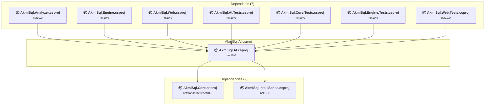

# src\AkmlSql.AI\AkmlSql.AI.csproj

[← Back to the assessment index](../../assessment.md)

## Project Info

- **Current Target Framework:** net10.0
- **Proposed Target Framework:** net11.0
- **SDK-style**: True
- **Project Kind:** ClassLibrary
- **Dependencies**: 2
- **Dependants**: 7
- **Number of Files**: 17
- **Number of Files with Incidents**: 3
- **Lines of Code**: 2646
- **Estimated LOC to modify**: 18+ (at least 0.7% of the project)

## Related Projects

**Depends on (2)** — projects this one references:

- [c:\Repos\AKML\AKML-SQL\src\AkmlSql.Core\AkmlSql.Core.csproj](../projects/AkmlSql.Core.md)
- [c:\Repos\AKML\AKML-SQL\src\AkmlSql.IntelliSense\AkmlSql.IntelliSense.csproj](../projects/AkmlSql.IntelliSense.md)

**Depended on by (7)** — projects that reference this one:

- [c:\Repos\AKML\AKML-SQL\src\AkmlSql.Analyzer\AkmlSql.Analyzer.csproj](../projects/AkmlSql.Analyzer.md)
- [c:\Repos\AKML\AKML-SQL\src\AkmlSql.Engine\AkmlSql.Engine.csproj](../projects/AkmlSql.Engine.md)
- [c:\Repos\AKML\AKML-SQL\src\AkmlSql.Web\AkmlSql.Web.csproj](../projects/AkmlSql.Web.md)
- [c:\Repos\AKML\AKML-SQL\tests\AkmlSql.AI.Tests\AkmlSql.AI.Tests.csproj](../projects/AkmlSql.AI.Tests.md)
- [c:\Repos\AKML\AKML-SQL\tests\AkmlSql.Core.Tests\AkmlSql.Core.Tests.csproj](../projects/AkmlSql.Core.Tests.md)
- [c:\Repos\AKML\AKML-SQL\tests\AkmlSql.Engine.Tests\AkmlSql.Engine.Tests.csproj](../projects/AkmlSql.Engine.Tests.md)
- [c:\Repos\AKML\AKML-SQL\tests\AkmlSql.Web.Tests\AkmlSql.Web.Tests.csproj](../projects/AkmlSql.Web.Tests.md)

## Dependency Graph

Legend:
📦 SDK-style project
⚙️ Classic project

## API Compatibility

| Category | Count | Impact |
| :--- | :---: | :--- |
| 🔴 Binary Incompatible | 0 | High - Require code changes |
| 🟡 Source Incompatible | 8 | Medium - Needs re-compilation and potential conflicting API error fixing |
| 🔵 Behavioral change | 10 | Low - Behavioral changes that may require testing at runtime |
| ✅ Compatible | 1991 |  |
| ***Total APIs Analyzed*** | ***2009*** |  |

