# src\AkmlSql.Core\AkmlSql.Core.csproj

[← Back to the assessment index](../../assessment.md)

## Project Info

- **Current Target Framework:** netstandard2.0;net10.0
- **Proposed Target Framework:** netstandard2.0;net10.0;net11.0
- **SDK-style**: True
- **Project Kind:** ClassLibrary
- **Dependencies**: 0
- **Dependants**: 18
- **Number of Files**: 0
- **Number of Files with Incidents**: 7
- **Lines of Code**: 0
- **Estimated LOC to modify**: 27+ (at least 0.0% of the project)

## Related Projects

**Depended on by (18)** — projects that reference this one:

- [c:\Repos\AKML\AKML-SQL\src\AkmlSql.AI\AkmlSql.AI.csproj](../projects/AkmlSql.AI.md)
- [c:\Repos\AKML\AKML-SQL\src\AkmlSql.Analysis\AkmlSql.Analysis.csproj](../projects/AkmlSql.Analysis.md)
- [c:\Repos\AKML\AKML-SQL\src\AkmlSql.Analyzer\AkmlSql.Analyzer.csproj](../projects/AkmlSql.Analyzer.md)
- [c:\Repos\AKML\AKML-SQL\src\AkmlSql.Engine\AkmlSql.Engine.csproj](../projects/AkmlSql.Engine.md)
- [c:\Repos\AKML\AKML-SQL\src\AkmlSql.IntelliSense\AkmlSql.IntelliSense.csproj](../projects/AkmlSql.IntelliSense.md)
- [c:\Repos\AKML\AKML-SQL\src\AkmlSql.Ssms22\AkmlSql.Ssms22.csproj](../projects/AkmlSql.Ssms22.md)
- [c:\Repos\AKML\AKML-SQL\src\AkmlSql.Updater\AkmlSql.Updater.csproj](../projects/AkmlSql.Updater.md)
- [c:\Repos\AKML\AKML-SQL\src\AkmlSql.VS2026\AkmlSql.VS2026.csproj](../projects/AkmlSql.VS2026.md)
- [c:\Repos\AKML\AKML-SQL\src\AkmlSql.Web\AkmlSql.Web.csproj](../projects/AkmlSql.Web.md)
- [c:\Repos\AKML\AKML-SQL\tests\AkmlSql.AI.Tests\AkmlSql.AI.Tests.csproj](../projects/AkmlSql.AI.Tests.md)
- [c:\Repos\AKML\AKML-SQL\tests\AkmlSql.Analysis.Tests\AkmlSql.Analysis.Tests.csproj](../projects/AkmlSql.Analysis.Tests.md)
- [c:\Repos\AKML\AKML-SQL\tests\AkmlSql.Core.Tests\AkmlSql.Core.Tests.csproj](../projects/AkmlSql.Core.Tests.md)
- [c:\Repos\AKML\AKML-SQL\tests\AkmlSql.E2E.Tests\AkmlSql.E2E.Tests.csproj](../projects/AkmlSql.E2E.Tests.md)
- [c:\Repos\AKML\AKML-SQL\tests\AkmlSql.Engine.Tests\AkmlSql.Engine.Tests.csproj](../projects/AkmlSql.Engine.Tests.md)
- [c:\Repos\AKML\AKML-SQL\tests\AkmlSql.Installer.Tests\AkmlSql.Installer.Tests.csproj](../projects/AkmlSql.Installer.Tests.md)
- [c:\Repos\AKML\AKML-SQL\tests\AkmlSql.IntelliSense.Tests\AkmlSql.IntelliSense.Tests.csproj](../projects/AkmlSql.IntelliSense.Tests.md)
- [c:\Repos\AKML\AKML-SQL\tests\AkmlSql.Shell.Shared.Tests\AkmlSql.Shell.Shared.Tests.csproj](../projects/AkmlSql.Shell.Shared.Tests.md)
- [c:\Repos\AKML\AKML-SQL\tests\AkmlSql.Web.Tests\AkmlSql.Web.Tests.csproj](../projects/AkmlSql.Web.Tests.md)

## Dependency Graph

Legend:
📦 SDK-style project
⚙️ Classic project

```mermaid
flowchart TB
    subgraph upstream["Dependants (18)"]
        P1["<b>📦&nbsp;AkmlSql.AI.csproj</b><br/><small>net10.0</small>"]
        P2["<b>📦&nbsp;AkmlSql.Analysis.csproj</b><br/><small>net10.0</small>"]
        P3["<b>📦&nbsp;AkmlSql.Analyzer.csproj</b><br/><small>net10.0</small>"]
        P5["<b>📦&nbsp;AkmlSql.Engine.csproj</b><br/><small>net10.0</small>"]
        P8["<b>📦&nbsp;AkmlSql.IntelliSense.csproj</b><br/><small>net10.0</small>"]
        P10["<b>📦&nbsp;AkmlSql.Ssms22.csproj</b><br/><small>net472</small>"]
        P11["<b>📦&nbsp;AkmlSql.Updater.csproj</b><br/><small>net10.0</small>"]
        P12["<b>📦&nbsp;AkmlSql.VS2026.csproj</b><br/><small>net472</small>"]
        P14["<b>📦&nbsp;AkmlSql.Web.csproj</b><br/><small>net10.0</small>"]
        P15["<b>📦&nbsp;AkmlSql.AI.Tests.csproj</b><br/><small>net10.0</small>"]
        P16["<b>📦&nbsp;AkmlSql.Analysis.Tests.csproj</b><br/><small>net10.0</small>"]
        P17["<b>📦&nbsp;AkmlSql.Core.Tests.csproj</b><br/><small>net10.0</small>"]
        P18["<b>📦&nbsp;AkmlSql.E2E.Tests.csproj</b><br/><small>net10.0</small>"]
        P19["<b>📦&nbsp;AkmlSql.Engine.Tests.csproj</b><br/><small>net10.0</small>"]
        P21["<b>📦&nbsp;AkmlSql.Installer.Tests.csproj</b><br/><small>net10.0</small>"]
        P22["<b>📦&nbsp;AkmlSql.IntelliSense.Tests.csproj</b><br/><small>net10.0</small>"]
        P23["<b>📦&nbsp;AkmlSql.Shell.Shared.Tests.csproj</b><br/><small>net472</small>"]
        P27["<b>📦&nbsp;AkmlSql.Web.Tests.csproj</b><br/><small>net10.0</small>"]
        click P1 "../projects/AkmlSql.AI.md"
        click P2 "../projects/AkmlSql.Analysis.md"
        click P3 "../projects/AkmlSql.Analyzer.md"
        click P5 "../projects/AkmlSql.Engine.md"
        click P8 "../projects/AkmlSql.IntelliSense.md"
        click P10 "../projects/AkmlSql.Ssms22.md"
        click P11 "../projects/AkmlSql.Updater.md"
        click P12 "../projects/AkmlSql.VS2026.md"
        click P14 "../projects/AkmlSql.Web.md"
        click P15 "../projects/AkmlSql.AI.Tests.md"
        click P16 "../projects/AkmlSql.Analysis.Tests.md"
        click P17 "../projects/AkmlSql.Core.Tests.md"
        click P18 "../projects/AkmlSql.E2E.Tests.md"
        click P19 "../projects/AkmlSql.Engine.Tests.md"
        click P21 "../projects/AkmlSql.Installer.Tests.md"
        click P22 "../projects/AkmlSql.IntelliSense.Tests.md"
        click P23 "../projects/AkmlSql.Shell.Shared.Tests.md"
        click P27 "../projects/AkmlSql.Web.Tests.md"
    end
    subgraph current["AkmlSql.Core.csproj"]
        MAIN["<b>📦&nbsp;AkmlSql.Core.csproj</b><br/><small>netstandard2.0;net10.0</small>"]
        click MAIN "../projects/AkmlSql.Core.md"
    end
    P1 --> MAIN
    P2 --> MAIN
    P3 --> MAIN
    P5 --> MAIN
    P8 --> MAIN
    P10 --> MAIN
    P11 --> MAIN
    P12 --> MAIN
    P14 --> MAIN
    P15 --> MAIN
    P16 --> MAIN
    P17 --> MAIN
    P18 --> MAIN
    P19 --> MAIN
    P21 --> MAIN
    P22 --> MAIN
    P23 --> MAIN
    P27 --> MAIN

```

## API Compatibility

| Category | Count | Impact |
| :--- | :---: | :--- |
| 🔴 Binary Incompatible | 0 | High - Require code changes |
| 🟡 Source Incompatible | 22 | Medium - Needs re-compilation and potential conflicting API error fixing |
| 🔵 Behavioral change | 5 | Low - Behavioral changes that may require testing at runtime |
| ✅ Compatible | 12191 |  |
| ***Total APIs Analyzed*** | ***12218*** |  |

## NuGet Package Issues

| Package | Current Version | Suggested Version | Severity | Issue |
| :--- | :---: | :---: | :---: | :--- |
| NETStandard.Library | 2.0.3 | — | 🔴 Mandatory | NuGet package functionality is included with framework reference |
| System.Text.Json | 10.0.11 | 10.0.12 | 🟡 Potential | NuGet package upgrade is recommended |

Every project affected by these packages, and the versions the repository settles on: [aggregate NuGet packages](../nuget/aggregate-packages.md).

