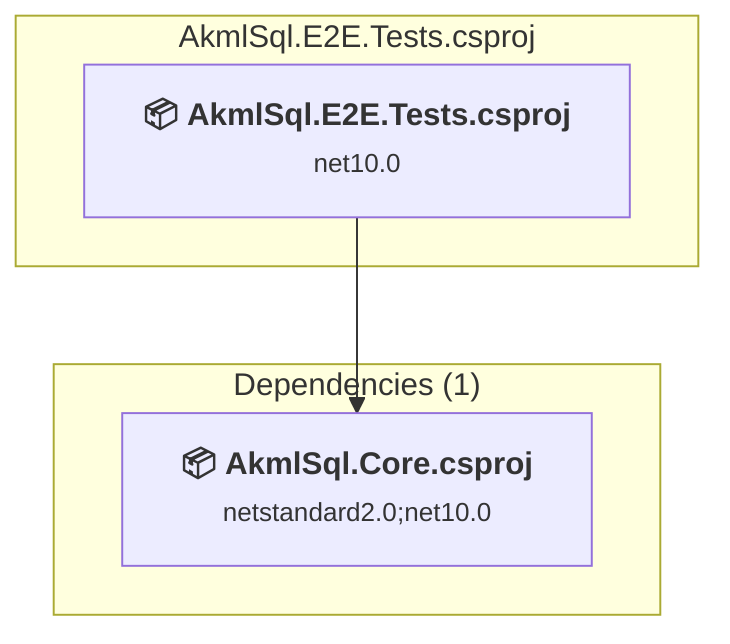

# tests\AkmlSql.E2E.Tests\AkmlSql.E2E.Tests.csproj

[← Back to the assessment index](../../assessment.md)

## Project Info

- **Current Target Framework:** net10.0
- **Proposed Target Framework:** net11.0
- **SDK-style**: True
- **Project Kind:** DotNetCoreApp
- **Dependencies**: 1
- **Dependants**: 0
- **Number of Files**: 21
- **Number of Files with Incidents**: 7
- **Lines of Code**: 2246
- **Estimated LOC to modify**: 27+ (at least 1.2% of the project)

## Related Projects

**Depends on (1)** — projects this one references:

- [c:\Repos\AKML\AKML-SQL\src\AkmlSql.Core\AkmlSql.Core.csproj](../projects/AkmlSql.Core.md)

## Dependency Graph

Legend:
📦 SDK-style project
⚙️ Classic project

## API Compatibility

| Category | Count | Impact |
| :--- | :---: | :--- |
| 🔴 Binary Incompatible | 0 | High - Require code changes |
| 🟡 Source Incompatible | 9 | Medium - Needs re-compilation and potential conflicting API error fixing |
| 🔵 Behavioral change | 18 | Low - Behavioral changes that may require testing at runtime |
| ✅ Compatible | 2775 |  |
| ***Total APIs Analyzed*** | ***2802*** |  |

## NuGet Package Issues

| Package | Current Version | Suggested Version | Severity | Issue |
| :--- | :---: | :---: | :---: | :--- |
| xunit | 2.9.3 | — | 🔵 Optional | NuGet package is deprecated |

Every project affected by these packages, and the versions the repository settles on: [aggregate NuGet packages](../nuget/aggregate-packages.md).

