# src\AkmlSql.Formatting\AkmlSql.Formatting.csproj

[← Back to the assessment index](../../assessment.md)

## Project Info

- **Current Target Framework:** net10.0
- **Proposed Target Framework:** net11.0
- **SDK-style**: True
- **Project Kind:** ClassLibrary
- **Dependencies**: 0
- **Dependants**: 8
- **Number of Files**: 67
- **Number of Files with Incidents**: 3
- **Lines of Code**: 14593
- **Estimated LOC to modify**: 2+ (at least 0.0% of the project)

## Related Projects

**Depended on by (8)** — projects that reference this one:

- [c:\Repos\AKML\AKML-SQL\src\AkmlSql.Analyzer\AkmlSql.Analyzer.csproj](../projects/AkmlSql.Analyzer.md)
- [c:\Repos\AKML\AKML-SQL\src\AkmlSql.Engine\AkmlSql.Engine.csproj](../projects/AkmlSql.Engine.md)
- [c:\Repos\AKML\AKML-SQL\src\AkmlSql.Formatter\AkmlSql.Formatter.csproj](../projects/AkmlSql.Formatter.md)
- [c:\Repos\AKML\AKML-SQL\src\AkmlSql.Web\AkmlSql.Web.csproj](../projects/AkmlSql.Web.md)
- [c:\Repos\AKML\AKML-SQL\tests\AkmlSql.Core.Tests\AkmlSql.Core.Tests.csproj](../projects/AkmlSql.Core.Tests.md)
- [c:\Repos\AKML\AKML-SQL\tests\AkmlSql.Engine.Tests\AkmlSql.Engine.Tests.csproj](../projects/AkmlSql.Engine.Tests.md)
- [c:\Repos\AKML\AKML-SQL\tests\AkmlSql.Formatting.Tests\AkmlSql.Formatting.Tests.csproj](../projects/AkmlSql.Formatting.Tests.md)
- [c:\Repos\AKML\AKML-SQL\tests\AkmlSql.Web.Tests\AkmlSql.Web.Tests.csproj](../projects/AkmlSql.Web.Tests.md)

## Dependency Graph

Legend:
📦 SDK-style project
⚙️ Classic project

```mermaid
flowchart TB
    subgraph upstream["Dependants (8)"]
        P3["<b>📦&nbsp;AkmlSql.Analyzer.csproj</b><br/><small>net10.0</small>"]
        P5["<b>📦&nbsp;AkmlSql.Engine.csproj</b><br/><small>net10.0</small>"]
        P6["<b>📦&nbsp;AkmlSql.Formatter.csproj</b><br/><small>net10.0</small>"]
        P14["<b>📦&nbsp;AkmlSql.Web.csproj</b><br/><small>net10.0</small>"]
        P17["<b>📦&nbsp;AkmlSql.Core.Tests.csproj</b><br/><small>net10.0</small>"]
        P19["<b>📦&nbsp;AkmlSql.Engine.Tests.csproj</b><br/><small>net10.0</small>"]
        P20["<b>📦&nbsp;AkmlSql.Formatting.Tests.csproj</b><br/><small>net10.0</small>"]
        P27["<b>📦&nbsp;AkmlSql.Web.Tests.csproj</b><br/><small>net10.0</small>"]
        click P3 "../projects/AkmlSql.Analyzer.md"
        click P5 "../projects/AkmlSql.Engine.md"
        click P6 "../projects/AkmlSql.Formatter.md"
        click P14 "../projects/AkmlSql.Web.md"
        click P17 "../projects/AkmlSql.Core.Tests.md"
        click P19 "../projects/AkmlSql.Engine.Tests.md"
        click P20 "../projects/AkmlSql.Formatting.Tests.md"
        click P27 "../projects/AkmlSql.Web.Tests.md"
    end
    subgraph current["AkmlSql.Formatting.csproj"]
        MAIN["<b>📦&nbsp;AkmlSql.Formatting.csproj</b><br/><small>net10.0</small>"]
        click MAIN "../projects/AkmlSql.Formatting.md"
    end
    P3 --> MAIN
    P5 --> MAIN
    P6 --> MAIN
    P14 --> MAIN
    P17 --> MAIN
    P19 --> MAIN
    P20 --> MAIN
    P27 --> MAIN

```

## API Compatibility

| Category | Count | Impact |
| :--- | :---: | :--- |
| 🔴 Binary Incompatible | 0 | High - Require code changes |
| 🟡 Source Incompatible | 0 | Medium - Needs re-compilation and potential conflicting API error fixing |
| 🔵 Behavioral change | 2 | Low - Behavioral changes that may require testing at runtime |
| ✅ Compatible | 24177 |  |
| ***Total APIs Analyzed*** | ***24179*** |  |

