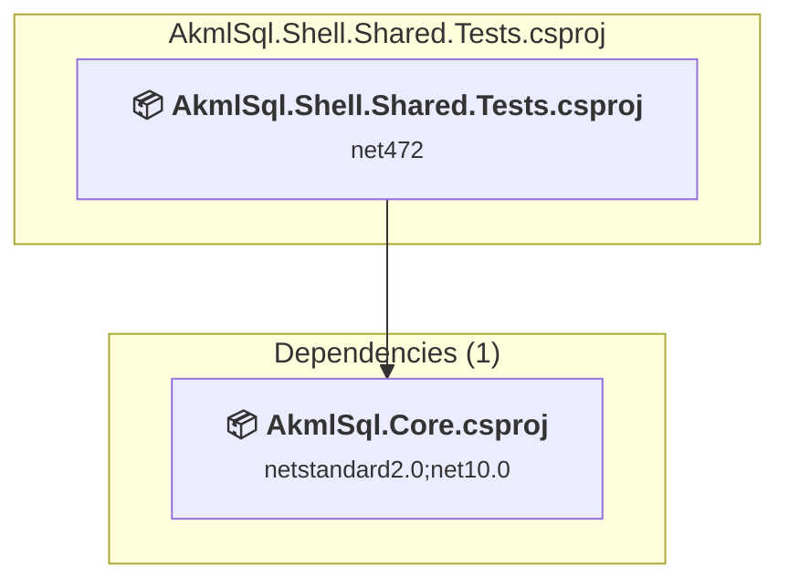

# tests\AkmlSql.Shell.Shared.Tests\AkmlSql.Shell.Shared.Tests.csproj

[← Back to the assessment index](../../assessment.md)

## Project Info

- **Current Target Framework:** net472
- **Proposed Target Framework:** net11.0-windows
- **SDK-style**: True
- **Project Kind:** WinForms
- **Dependencies**: 1
- **Dependants**: 0
- **Number of Files**: 332
- **Number of Files with Incidents**: 242
- **Lines of Code**: 72001
- **Estimated LOC to modify**: 36714+ (at least 51.0% of the project)

## Related Projects

**Depends on (1)** — projects this one references:

- [c:\Repos\AKML\AKML-SQL\src\AkmlSql.Core\AkmlSql.Core.csproj](../projects/AkmlSql.Core.md)

## Dependency Graph

Legend:
📦 SDK-style project
⚙️ Classic project

## API Compatibility

| Category | Count | Impact |
| :--- | :---: | :--- |
| 🔴 Binary Incompatible | 36028 | High - Require code changes |
| 🟡 Source Incompatible | 651 | Medium - Needs re-compilation and potential conflicting API error fixing |
| 🔵 Behavioral change | 35 | Low - Behavioral changes that may require testing at runtime |
| ✅ Compatible | 56777 |  |
| ***Total APIs Analyzed*** | ***93491*** |  |

## NuGet Package Issues

| Package | Current Version | Suggested Version | Severity | Issue |
| :--- | :---: | :---: | :---: | :--- |
| Microsoft.VisualStudio.Language.Intellisense | 17.14.249 | — | 🔴 Mandatory | NuGet package is incompatible |
| Microsoft.VisualStudio.SDK | 17.14.40265 | 16.0.208 | 🔴 Mandatory | NuGet package is incompatible |
| Microsoft.VisualStudio.Text.UI.Wpf | 17.14.249 | — | 🔴 Mandatory | NuGet package is incompatible |
| xunit | 2.9.3 | — | 🔵 Optional | NuGet package is deprecated |

Every project affected by these packages, and the versions the repository settles on: [aggregate NuGet packages](../nuget/aggregate-packages.md).

## Project Technologies and Features

| Technology | Issues | Percentage | Migration Path |
| :--- | :---: | :---: | :--- |
| Windows Forms Legacy Controls | 1366 | 3.7% | Legacy Windows Forms controls that have been removed from .NET Core/5+ including StatusBar, DataGrid, ContextMenu, MainMenu, MenuItem, and ToolBar. These controls were replaced by more modern alternatives. Use ToolStrip, MenuStrip, ContextMenuStrip, and DataGridView instead. |
| GDI+ / System.Drawing | 544 | 1.5% | System.Drawing APIs for 2D graphics, imaging, and printing that are available via NuGet package System.Drawing.Common. Note: Not recommended for server scenarios due to Windows dependencies; consider cross-platform alternatives like SkiaSharp or ImageSharp for new code. |
| Windows Forms | 7987 | 21.8% | Windows Forms APIs for building Windows desktop applications with traditional Forms-based UI that are available in .NET on Windows. Enable Windows Desktop support: Option 1 (Recommended): Target net9.0-windows; Option 2: Add <UseWindowsDesktop>true</UseWindowsDesktop>; Option 3 (Legacy): Use Microsoft.NET.Sdk.WindowsDesktop SDK. |
| WPF (Windows Presentation Foundation) | 16711 | 45.5% | WPF APIs for building Windows desktop applications with XAML-based UI that are available in .NET on Windows. WPF provides rich desktop UI capabilities with data binding and styling. Enable Windows Desktop support: Option 1 (Recommended): Target net9.0-windows; Option 2: Add <UseWindowsDesktop>true</UseWindowsDesktop>. |

