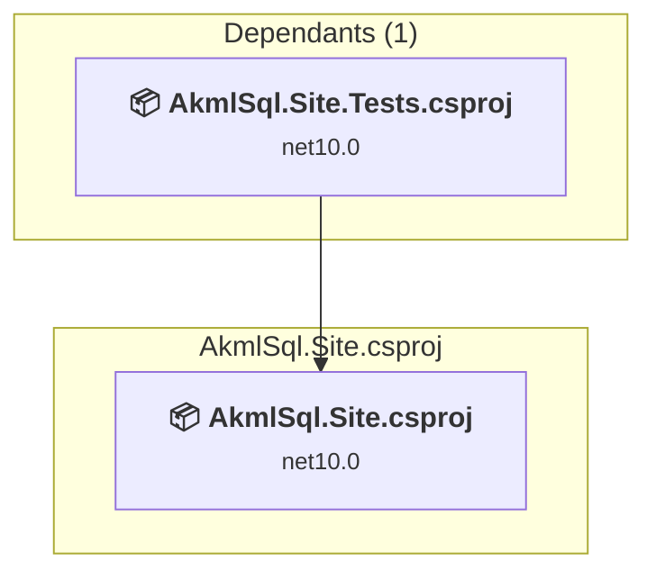

# src\AkmlSql.Site\AkmlSql.Site.csproj

[← Back to the assessment index](../../assessment.md)

## Project Info

- **Current Target Framework:** net10.0
- **Proposed Target Framework:** net11.0
- **SDK-style**: True
- **Project Kind:** AspNetCore
- **Dependencies**: 0
- **Dependants**: 1
- **Number of Files**: 116
- **Number of Files with Incidents**: 17
- **Lines of Code**: 8731
- **Estimated LOC to modify**: 53+ (at least 0.6% of the project)

## Related Projects

**Depended on by (1)** — projects that reference this one:

- [c:\Repos\AKML\AKML-SQL\tests\AkmlSql.Site.Tests\AkmlSql.Site.Tests.csproj](../projects/AkmlSql.Site.Tests.md)

## Dependency Graph

Legend:
📦 SDK-style project
⚙️ Classic project

## API Compatibility

| Category | Count | Impact |
| :--- | :---: | :--- |
| 🔴 Binary Incompatible | 7 | High - Require code changes |
| 🟡 Source Incompatible | 9 | Medium - Needs re-compilation and potential conflicting API error fixing |
| 🔵 Behavioral change | 37 | Low - Behavioral changes that may require testing at runtime |
| ✅ Compatible | 9498 |  |
| ***Total APIs Analyzed*** | ***9551*** |  |

