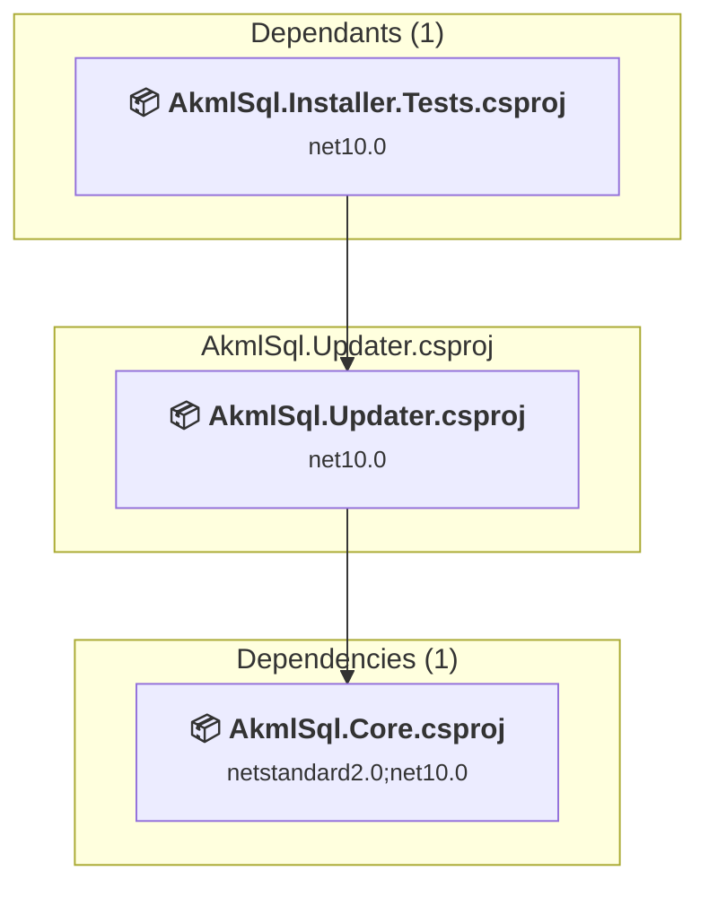

# src\AkmlSql.Updater\AkmlSql.Updater.csproj

[← Back to the assessment index](../../assessment.md)

## Project Info

- **Current Target Framework:** net10.0
- **Proposed Target Framework:** net11.0
- **SDK-style**: True
- **Project Kind:** DotNetCoreApp
- **Dependencies**: 1
- **Dependants**: 1
- **Number of Files**: 2
- **Number of Files with Incidents**: 3
- **Lines of Code**: 394
- **Estimated LOC to modify**: 6+ (at least 1.5% of the project)

## Related Projects

**Depends on (1)** — projects this one references:

- [c:\Repos\AKML\AKML-SQL\src\AkmlSql.Core\AkmlSql.Core.csproj](../projects/AkmlSql.Core.md)

**Depended on by (1)** — projects that reference this one:

- [c:\Repos\AKML\AKML-SQL\tests\AkmlSql.Installer.Tests\AkmlSql.Installer.Tests.csproj](../projects/AkmlSql.Installer.Tests.md)

## Dependency Graph

Legend:
📦 SDK-style project
⚙️ Classic project

## API Compatibility

| Category | Count | Impact |
| :--- | :---: | :--- |
| 🔴 Binary Incompatible | 0 | High - Require code changes |
| 🟡 Source Incompatible | 1 | Medium - Needs re-compilation and potential conflicting API error fixing |
| 🔵 Behavioral change | 5 | Low - Behavioral changes that may require testing at runtime |
| ✅ Compatible | 406 |  |
| ***Total APIs Analyzed*** | ***412*** |  |

