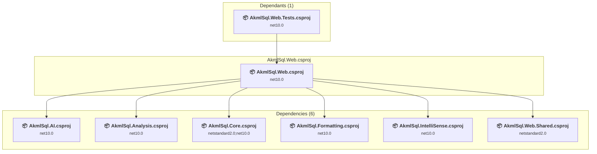

# src\AkmlSql.Web\AkmlSql.Web.csproj

[← Back to the assessment index](../../assessment.md)

## Project Info

- **Current Target Framework:** net10.0
- **Proposed Target Framework:** net11.0
- **SDK-style**: True
- **Project Kind:** AspNetCore
- **Dependencies**: 6
- **Dependants**: 1
- **Number of Files**: 122
- **Number of Files with Incidents**: 4
- **Lines of Code**: 7818
- **Estimated LOC to modify**: 16+ (at least 0.2% of the project)

## Related Projects

**Depends on (6)** — projects this one references:

- [c:\Repos\AKML\AKML-SQL\src\AkmlSql.AI\AkmlSql.AI.csproj](../projects/AkmlSql.AI.md)
- [c:\Repos\AKML\AKML-SQL\src\AkmlSql.Analysis\AkmlSql.Analysis.csproj](../projects/AkmlSql.Analysis.md)
- [c:\Repos\AKML\AKML-SQL\src\AkmlSql.Core\AkmlSql.Core.csproj](../projects/AkmlSql.Core.md)
- [c:\Repos\AKML\AKML-SQL\src\AkmlSql.Formatting\AkmlSql.Formatting.csproj](../projects/AkmlSql.Formatting.md)
- [c:\Repos\AKML\AKML-SQL\src\AkmlSql.IntelliSense\AkmlSql.IntelliSense.csproj](../projects/AkmlSql.IntelliSense.md)
- [c:\Repos\AKML\AKML-SQL\src\AkmlSql.Web.Shared\AkmlSql.Web.Shared.csproj](../projects/AkmlSql.Web.Shared.md)

**Depended on by (1)** — projects that reference this one:

- [c:\Repos\AKML\AKML-SQL\tests\AkmlSql.Web.Tests\AkmlSql.Web.Tests.csproj](../projects/AkmlSql.Web.Tests.md)

## Dependency Graph

Legend:
📦 SDK-style project
⚙️ Classic project

## API Compatibility

| Category | Count | Impact |
| :--- | :---: | :--- |
| 🔴 Binary Incompatible | 0 | High - Require code changes |
| 🟡 Source Incompatible | 1 | Medium - Needs re-compilation and potential conflicting API error fixing |
| 🔵 Behavioral change | 15 | Low - Behavioral changes that may require testing at runtime |
| ✅ Compatible | 7570 |  |
| ***Total APIs Analyzed*** | ***7586*** |  |

